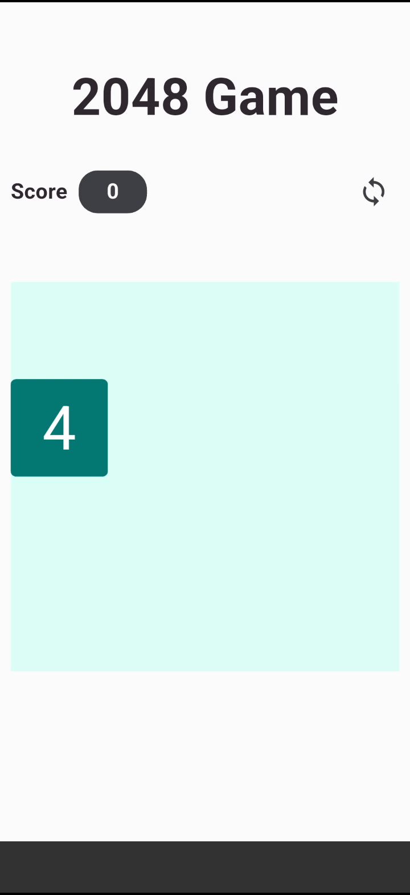
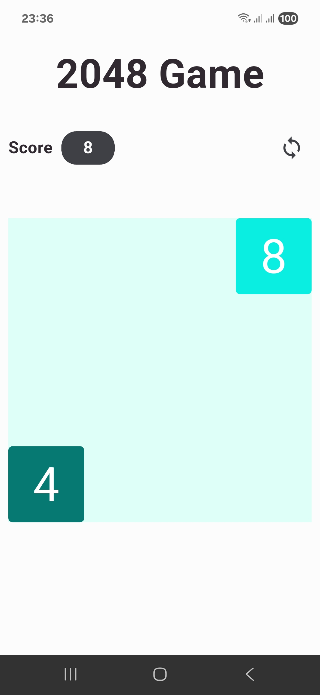
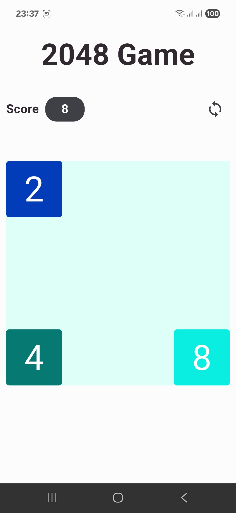
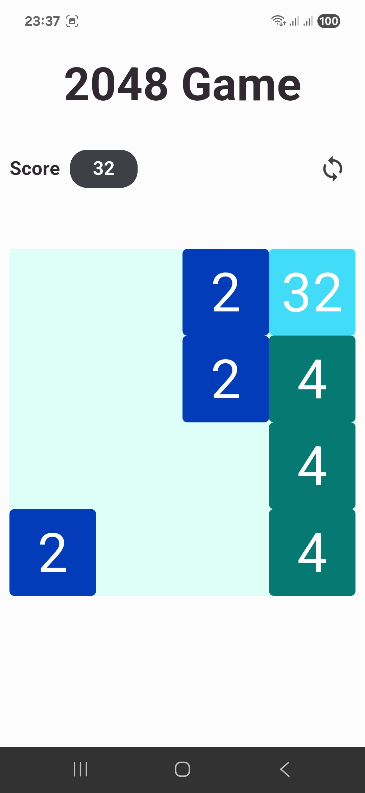
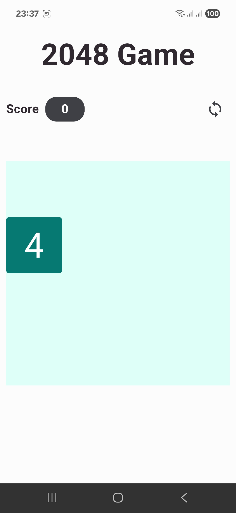

# 2048 Game in Flutter with Redux

A modern and responsive implementation of the classic 2048 game, built with Flutter and powered by Redux for robust and predictable state management.

---

## 📖 Table of Contents

- [About The Project](#-about-the-project)
    - [Core Technologies](#️-core-technologies)
- [✨ Features](#-features)
- [📸 Screenshots](#-screenshots)
- [🏗️ Architecture: State Management with Redux](#️-architecture-state-management-with-redux)
- [🚀 Getting Started](#-getting-started)
    - [Prerequisites](#prerequisites)
    - [Installation](#installation)

---

## 💻 About The Project

This project is a clone of the popular 2048 puzzle game, developed entirely in Flutter. The goal is to provide a clean, performant, and enjoyable gaming experience on both Android and iOS devices.

A key aspect of this project is its architecture, which leverages the Redux pattern for predictable and centralized state management. This approach makes the application's logic easy to understand, debug, and scale.

### 🛠️ Core Technologies

-   **[Flutter](https://flutter.dev/):** For building a beautiful and natively compiled application from a single codebase.
-   **[Redux](https://pub.dev/packages/redux):** As the core of the state management architecture, providing a single source of truth for the application state.
-   **[flutter\_redux](https://pub.dev/packages/flutter_redux):** The bridge for connecting the Redux store to Flutter widgets.
-   **[redux\_thunk](https://pub.dev/packages/redux_thunk):** Middleware that allows for handling asynchronous logic and side effects, such as dispatching multiple actions or complex game logic.

---

## ✨ Features

-   **Classic 2048 Gameplay:** Swipe to move tiles. When two tiles with the same number touch, they merge into one!
-   **Responsive UI:** The layout adapts to various screen sizes and orientations.
-   **Score Tracking:** Your current score and best score are always visible.
-   **Smooth Animations:** Fluid animations for tile movement and merging.
-   **New Game:** Start a new game at any time.

---

## 📸 Screenshots

   &nbsp;
   &nbsp;
   &nbsp;
  

---

## 🏗️ Architecture: State Management with Redux

This project uses a unidirectional data flow powered by Redux, which makes the state of the app predictable and easy to trace.

1.  **State:** The entire state of the application (e.g., the grid, tiles, score, game-over status) is stored in a single immutable object tree within one `Store`. This provides a single source of truth.
2.  **Actions:** The only way to change the state is by dispatching an `Action`, which is a plain object describing what happened (e.g., `MoveUpAction`, `MergeTilesAction`).
3.  **Reducers:** These are pure functions that take the previous state and an action, and return the next state. The logic for how the state tree changes in response to an action is defined here.
4.  **Middleware (`redux_thunk`):** For logic that needs to be asynchronous or have side effects (like checking for available moves after a swipe or handling game over), `redux_thunk` is used. It allows action creators to return a function that can dispatch other actions.
5.  **UI (Flutter Widgets):** The UI is built with Flutter widgets that connect to the Redux `Store` using `StoreConnector`. When the state changes, the relevant widgets automatically rebuild to reflect the new state, ensuring the UI is always in sync.

---

## 🚀 Getting Started

To get a local copy up and running, follow these simple steps.

### Prerequisites

-   Flutter SDK: [Installation Guide](https://flutter.dev/docs/get-started/install)
-   An IDE like VS Code or Android Studio.

### Installation

1.  **Clone the repo**
2.  **Navigate to the project directory**
3.  **Install dependencies**
4.  **Run the app**
         
    
    